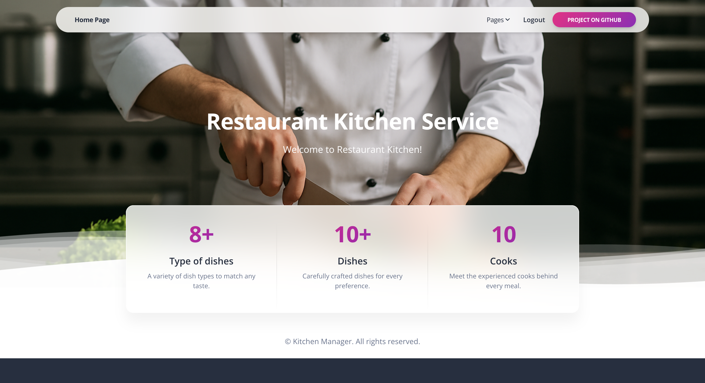
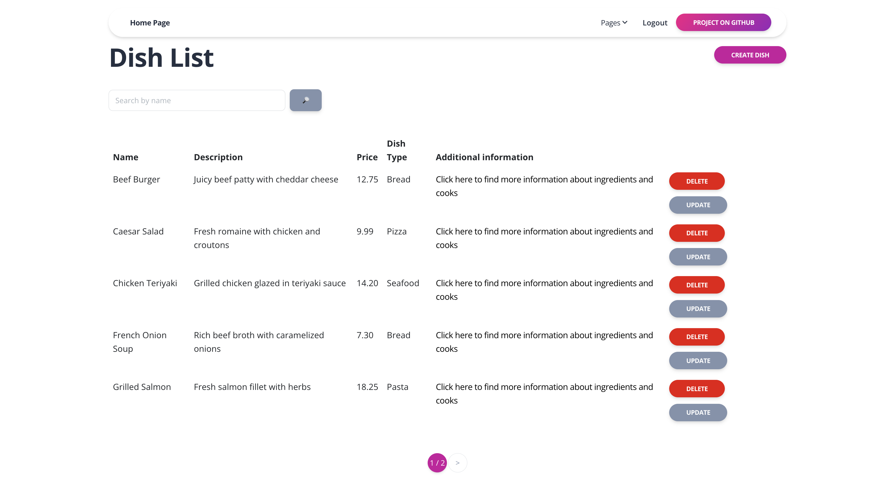
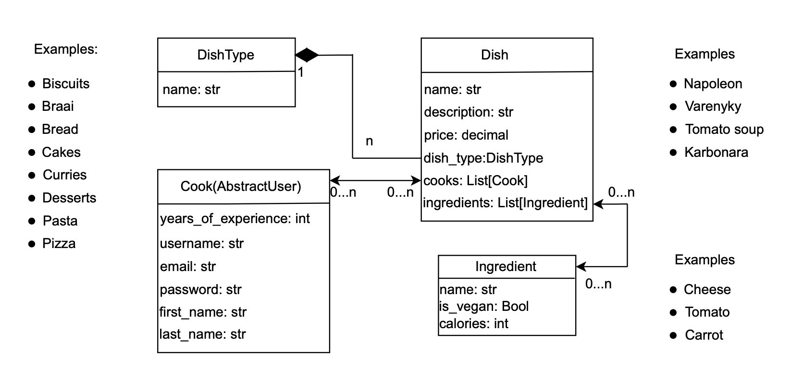

# Restaurant Kitchen Service

## Description of the project:

This project aims to improve efficiency and organization in a restaurant kitchen
by helping cooks collaborate more effectively and follow clear responsibilities.
The system defines who is responsible for preparing each dish, ensuring tasks are
distributed clearly across the team.


## Discover the kitchen system!

(Wait a minute for the server to load)

[Check it out! Restaurant Kitchen Service deployed on Render](https://kitchen-manager-wcld.onrender.com)

### Login Information

Use the following credentials to login:

- **Username:** admin
- **Password:** 1qazcde3

## Technologies used:
In this project I used the following technologies:
  - Python
  - Django
  - HTML
  - CSS

## Installation:
To run the project locally on your computer, execute the following commands in a terminal:
```
git clone https://github.com/PavloDanylkiv/kitchen_manager.git
python -m venv venv
venv\Scripts\activate (on Windows)
source venv/bin/activate (on macOS)
pip install -r requirements.txt
python manage.py runserver
```

## Commands to test the project:
You can use the following commands to run written tests and check the code style using flake8:
```
python manage.py test
flake8
```

## Description main features:

- **Simple and User-Friendly Interface**:
  
    Designed with simplicity in mind, the system offers a clean and accessible interface that streamlines the creation and organization of dish types, individual dishes, and cook profiles.


- **Structured Dish Handling**:
  
    Users can effortlessly define new dish types and manage individual dishes, making it easier to structure kitchen tasks and optimize workflow.


- **Cooks Management**:

    The platform supports efficient management of cooks, allowing users to add detailed cook information and assign them to specific dishes—ensuring clear responsibilities and accurate tracking in the kitchen.

## Screenshots:




## Database structure:
